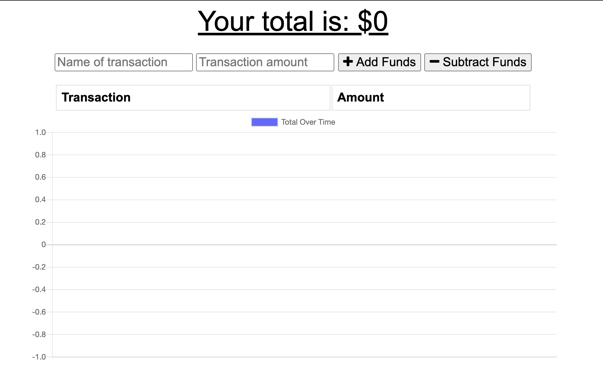
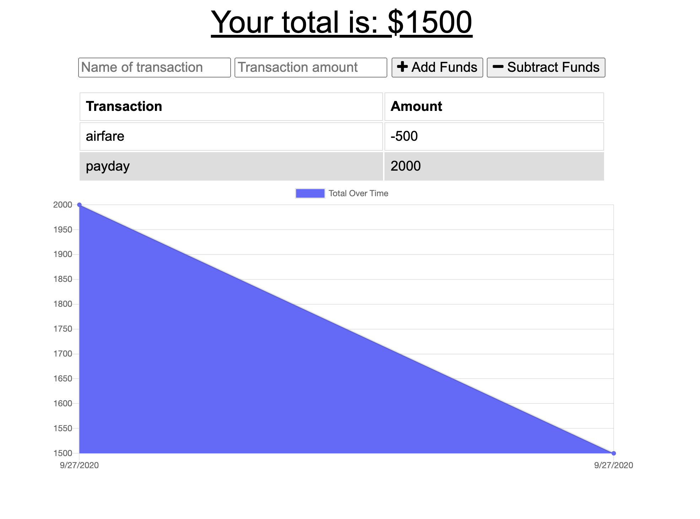

# Social Media API

## Deployed Link
https://pure-waters-43338.herokuapp.com/

## Description: 

This application allows users to budget their money, even when on vacation and cell service is spotty. This application will still function while offline, saving the transactions that occur while offline to an IndexedDB database. Once back online, it will post those trascactions so that data is not lost. Additionally, with the use of a service worker, the app saves all of the files to cached storage for offline use. Lastly, this is a Progressive Web App (PWA). You can install this app to your device for easy access and use.

## Table of Contents
* [Built With](#builtwith)
* [Screenshots](#screenshots)
* [Questions](#questions)

## Built With
* MongoDB
* Express.js
* Mongoose
* Mongo DB Atlas
* IndexedDB

## Screenshots

    

## Questions? 

If you have any additional questions, feel free to contact me: 
GitHub: https://github.com/MelissaBCadena 
Email: melissabcadena@gmail.com